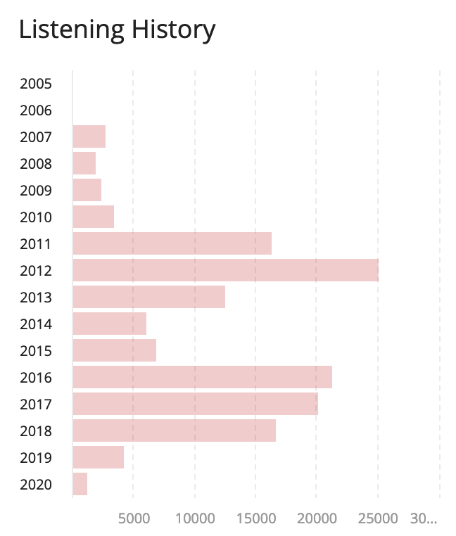

+++
title="New Music:  January 2020"
date=2020-02-07
+++

{{ spotify(type="playlist", id="62ng027i0r0xJzTdt20yE0?si=LPKNjJBeSUOYxeYDAK2W0g") }}

I did a very bad job of discovering new music in 2019.  Heck, I did a bad job of _listening_ to music in 2019.  Here's a chart of the total number of songs I've listened to and scrobbled to last.fm, organized by year:

Sad, right?  I can do better, and I'm going to this year.  Here are some highlights from January 2020:

## Brand-new music

### Clairo — Bags

{{ spotify(type="track", id="6UFivO2zqqPFPoQYsEMuCc?si=Zc8TWaaXTAeshg2LYlNdXw") }}

This is probably my favorite song to come out of 2019.  The driving backbeat, soothing vocals, and Gotye-esque melodic line just come together so well.  It's strangely emotional, hitting me in the same way that Miya Folick's "I Got Drunk" can make me misty before I even realize that feelings are creeping up on me.

Is it cheating to say that this song is brand new when it's over half a year old?  Probably, but I promise the rest of these lists will tighten up that window.

### Laumé — Voyeurs

{{ spotify(type="track", id="6MpYUXjDrJIDKkrnJIoDN4?si=Yum-Il0gT3OFxSY-LmiQtA") }}

Laumé's forrays into disco-inspired electronica in her most recent record, Waterbirth, are unforgettable.  They refuse to get unstuck from my head.  Some other tracks can feel a little off, mostly because of the vocal layering not really coming together for me, but I still highly recommend the record as a whole.  This song will definitely be one that I look back on as a favorite from 2020.

### …And You Will Know Us by the Trail of Dead — Gravity

{{ spotify(type="track", id="44q2gEhrJVIQtFRDeBiMeR?si=hJZW6REpTQWaAk1LVtEemQ") }}

Ten records!  Holy cow!

X: The Godless Void and Other Stories feels like we're coming back to Indie Metal from a more experimental detour in IX.  It's a good album, but it just doesn't stand out from the rest of their catalog for me.

Take, for example, this song, "Gravity." This track seems to call back to "Isis Unveiled" twice:  in the group chanting beginning "The torture of eight days straight…" and the descending descending vocal growl at "Oh bloody hell…"

Other Trail of Dead fans I talk to seem not to like "The Century of Self" as much as I do — see its 6.8 on Pitchfork compared to X's 7.8.  But there's just something about how _Century_'s live-recorded style packs a huge punch that I haven't heard from any other album ever, be it by AYWKUBTTOD or anyone else.

### Sea Girls — Ready For More

{{ spotify(type="track", id="0DSHQkFL8ppNiYJgFaOq6r?si=L9KKlY6rRkq8aIiaRiRMwA") }}

It's a pop song.  It's got strings in the background, if you listen close.  It will be on the radio.  It's pretty good.

### Holy Fuck — Moment

{{ spotify(type="track", id="0N0zNZTH1vvpPDbYSmU0Ch?si=Ufm4cYreTbSwPt-MuTG2DQ") }}

This song would be in a movie if some executive wouldn't say "Come on, we can't put that band's name in the credits."  In reality, it should be at least forever immortalized as the title track to a very good T.V. show.

It almost half the song for the vocals to come in, but the buildup is worth it.  This track sits on such a fun edge of danceability — if I heard this playing in a public place, I'd be ready to groove but also sort of frightened.

## Discoveries

### Alvvays — In Undertow

{{ spotify(type="track", id="1gvaxqNiJEbQzWPqs72kgG?si=GkVMelHwRpCBBNa45qjjzQ") }}

Alvvays, as always, knocked it out of the park with this song 2017.  I heard it on this record when it had come out originally, but didn't really appreciate it then.  The ripping, layered guitar lines come together to build to an engaging final refrain and wrap up so sweetly.

### Underworld — I Exhale

{{ spotify(type="track", id="0xNpOEFrmgaMeMESVdnG9Z?si=gjGXSYI1TIKnb9nUYYGhOw") }}

Eight minutes!

This song gives me the same feelings that LCD Soundsystem's more emotional tracks do.  Though I don't find the lyrics as touching, the mechanical rhythm and repeating chords don't go stale, but get somehow sadder as the song proceeds.  The hidden digital distortion combined with falsetto howling don't sound as bad as the combination of the words "digital distortion combined with falsetto howling" would lead you to believe — it all comes together for a powerful package that you can put on in the background while, I don't know, washing the dishes and thinking about your life.  You know, as one does while listening to LCD Soundsystem.

### Eternal Summers — You Kill

{{ spotify(type="track", id="0XeKdDTOYosn0ptOTtVf2R?si=_Wx8-n-lTGSJOLDVfAcPdw") }}

Sick riffs and Nicole Yun's powerful vocal performance make this poppy track inspirational.  I should spend more time with this group's catalog — based on this one track, I'm sure there's many more hits in there.

As I write this, this track has around 200,000 plays on Spotify, which seems like an actual crime.  Eternal Summers should be playing this song in a stadium, where the guitar will kick in and roll out to the lawn seats like a scene from _Scott Pilgrim vs. the World_.

### Siouxsie and the Banshees — Into The Light

{{ spotify(type="track", id="01V0Tau0s8AQkUm6ae1rEF?si=ImFhTxdjRrGNmPwcHGIwbg") }}

How had I never listened to Siouxsie and the Banshees?  What instrument even is that in the verse?  How did this sound even exist in 1981?

### NAVVI — From The End And Start

{{ spotify(type="track", id="4In0EawTl71Y0Lktrg9F3q?si=06N8H-XVQ9mo6iYrjTjDvw") }}

A music critic referred to NAVVI as synth-pop, which I don't think quite fits.  They're like… dark electronica with indie roots.  They're like if The XX had a goth phase.  They're so good, especially this track.
